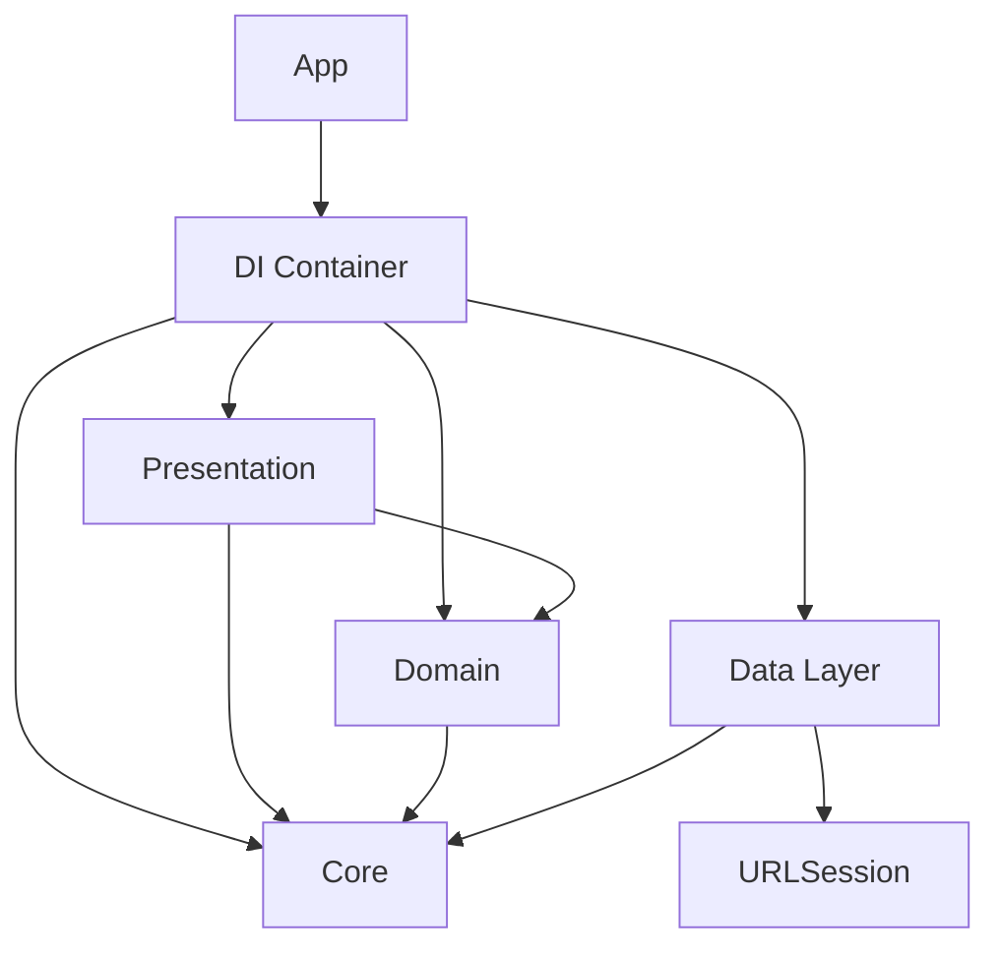

# 📸 photoUIKit - Clean Architecture Demo
A simple iOS application built with **Clean Architecture principles**, featuring a modular design with clear separation of concerns.
This project demonstrates best practices for **scalable, testable, and maintainable iOS development** using **Swift** and **UIKit**.
It fetches and displays a paginated list of photos from the [Picsum.photos API](https://picsum.photos).
---
## 🏛️ Architecture Overview
This project implements **Clean Architecture (Onion Architecture)** with the following key principles:
- **Dependency Rule:** Dependencies only point inward. Inner layers know nothing about outer layers.
- **Separation of Concerns:** Each layer has a specific responsibility.
- **Testability:** Business logic is isolated and easily testable.
- **Independence:** Business logic is independent of UI, networking, and frameworks.
- **Reusability:** Modules are designed for easy reuse and extension.
### Architecture Diagram
```
┌─────────────────────────────────────────────────────┐
│ Presentation                                        │
│ (ViewModels, UI Models)                             │
├─────────────────────────────────────────────────────┤
│ Domain                                              │
│ (Use Cases)                                         │
├─────────────────────────────────────────────────────┤
│ Data Layer                                          │
│ (Repositories, DTOs, Network)                       │
├─────────────────────────────────────────────────────┤
│ Core                                                │
│ (Entities, Protocols, Errors)                       │
└─────────────────────────────────────────────────────┘
```
**Dependencies: ↓ (only inward)**
---
## 📁 Project Structure
```
Modules/
├── Core/ # Business entities & contracts
│ ├── Entities/ # Business models
│ │ └── PhotoEntity.swift
│ ├── Protocols/ # Repository and API interfaces
│ │ ├── PhotoRepositoryProtocol.swift
│ │ ├── APIEnviroments.swift
│ │ ├── APIOperation.swift
│ │ └── APIRequest.swift
│ ├── Errors/ # Domain errors
│ │ └── DomainError.swift
│ ├── Network/ # HTTP utilities
│ │ ├── HeaderField.swift
│ │ └── HTTPMethod.swift
│ └── Extensions/ # URLRequest extensions
│   └── URLRequest+Network.swift
│
├── Domain/ # Business rules
│ └── UseCases/ # Application use cases
│   └── FetchPhotosUseCase.swift
│
├── DataLayer/ # Data management
│ ├── Configuration/ # API configurations
│ │ ├── NetworkConfig.swift
│ │ └── NetworkEnvironment.swift
│ ├── DTOs/ # Data transfer objects
│ │ └── PhotoDTOs.swift
│ ├── Mappers/ # DTO to Entity mappers
│ │ └── PhotoMapper.swift
│ ├── Network/ # API clients and operations
│ │ ├── PhotoListRequest.swift
│ │ ├── APIOperation.swift
│ │ └── APIRequest+Ex.swift
│ └── Repositories/ # Repository implementations
│   └── PhotoRepository.swift
│
├── Presentation/ # UI layer
│ ├── ViewModels/ # Presentation logic
│ │ ├── PhotoViewModel.swift
│ │ └── PhotoEntityViewModel.swift
│ └── Views/ # UIKit Views
│   ├── PhotoListViewController.swift # (Example: List of photos with UITableView)
│   └── AppDelegate.swift # (Example: Main entry point)
│   └── SceneDelegate.swift # (For scene management)
│
└── DI/ # Dependency injection
    └── DIContainer.swift
```
---
## ✨ Key Features
### 🧩 Architecture Features
- ✅ Clean Architecture with dependency inversion
- ✅ Modular, testable, and reusable design
- ✅ SOLID principles applied
- ✅ Type-safe concurrency using `Sendable`
### 📱 Application Features
- 📷 Fetch and paginate photo lists
- ⚡ Real-time loading and state management
- 🚨 Domain-based error handling
### 🎨 UI/UX Features
- Built entirely with **UIKit**
- Clean, minimal UI with loading indicators
- Infinite scroll or "Load More" pagination using UITableView
---
## 🛠️ Technology Stack
| Component | Technology |
|------------|-------------|
| Language | Swift 6.2 |
| UI | UIKit |
| iOS Target | iOS 17.0+ |
| Architecture | Clean Architecture |
| Networking | URLSession (async/await) |
| Dependency | Swift Package Manager |
| Concurrency | Swift Concurrency (async/await) |
---
## 🚀 Getting Started
### Prerequisites
- Xcode 16.0 or later
- iOS 17.0+ deployment target
- Swift 6.2
### Installation
```bash
git clone https://github.com/yourusername/photoUIKit.git
cd photoUIKit
open photoUIKit.xcodeproj
```
Then build and run (`Cmd + R`).
> No API keys required — uses a public endpoint.
---
## 📦 Module Dependencies
### 🧭 Dependency Graph

### 🧩 Module Descriptions
| Module | Dependencies | Description |
|---------|---------------|-------------|
| **Core** | None | Defines business entities, domain protocols, and errors. Innermost and most stable layer. |
| **Domain** | Core | Contains application use cases — pure business logic independent of frameworks. |
| **DataLayer** | Core | Handles external data sources: API requests, repositories, DTOs, and mappers. |
| **Presentation** | Domain, Core | UIKit-based UI and ViewModels that observe app states and handle user interaction. |
| **DI (Dependency Injection)** | All modules | Centralized dependency resolver managing object creation and wiring. |
---
## 📊 Layer Responsibilities
### 🧱 Core Layer
- Entities, Protocols, Errors
- Pure business logic, no framework dependency
### ⚙️ Domain Layer
- Use Cases that define business rules
### 🌐 Data Layer
- Repository implementations, DTOs, API requests
### 🎨 Presentation Layer
- UIKit ViewControllers + ViewModels managing state
---
## 🔄 Data Flow Example
```
User Input (ViewController)
    ↓
PhotoViewModel (Presentation)
    ↓
FetchPhotosUseCase (Domain)
    ↓
PhotoRepository (Data)
    ↓
API Client (External)
    ↓
DTO → Entity Mapping
    ↓
UI Update
```
---
## 🧪 Testing
- **Unit Tests:** Mock repositories and test use cases.
- **Integration Tests:** Real API repository tests.
- **UI Tests:** XCTest for UIKit views and interactions.
Example:
```swift
func testFetchPhotosSuccess() async throws {
    let mockRepo = MockPhotoRepository()
    let useCase = FetchPhotosUseCase(photoRepository: mockRepo)
    let result = try await useCase.execute(limit: 10, offset: 1)
    XCTAssertEqual(result?.count, 10)
}
```
---
## 📐 Best Practices
- Use **Dependency Injection** via `DIContainer`
- Follow **Protocol-Oriented Programming**
- Apply **ViewModel pattern** for state management
- Handle errors via `DomainError`
- Ensure thread safety with `Sendable`
- Modularize code by responsibility
---
## 🔒 Security & ⚡ Performance
- ✅ Public API — no keys exposed
- ✅ Validate all input data
- ✅ Efficient pagination and lazy loading
---
## 🤝 Contributing
1. Fork the repo
2. Create a feature branch
   ```bash
   git checkout -b feat/new-feature
   ```
3. Commit your changes
   ```bash
   git commit -m "feat: add new feature"
   ```
4. Push and open a Pull Request
### Commit Convention
| Type | Meaning |
|-------|----------|
| feat | New feature |
| fix | Bug fix |
| docs | Documentation only |
| refactor | Code refactor |
| test | Add/Update tests |
| chore | Maintenance |
---
## 📄 License
MIT License – see `LICENSE` for details.
---
## ⭐ Contact
If you find this project helpful, please give it a **⭐ star**!
For questions, open an issue on GitHub.
